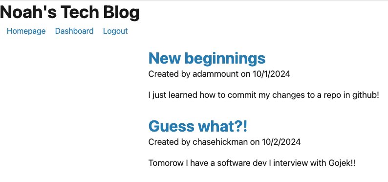

# Noah-Tech-Blog
Challenge 14

## Description
During this project I demonstrated my understanding of creating my first official full-stack web application from scratch. I proved that I know how to configure a working Express.js API and that I could use Sequelize to interact with a MySQL database. I also proved that I know how to enter schema and seed commands to populate fake data in my application's database. Regrading API routes, I successfully demonstrated my ability to write GET, DELETE, and POST routes for the different tables of data on this application. I also created user authentication, used handlebars to create different views on my application, and even utilized many different npm packages to speed up the creation of my application.

## Installation
This project is deployed on Heroku and can be viewed [here](https://tech-blog-84849999-1510562f600e.herokuapp.com/).

## Usage
This project can be used as an example of how a blog application would function. THe user has the ability to create an account, and once they are logged in, they can create posts of their own that will display on the homepage. Logged in users will also be able to leave comments on other blog posts, and they can also choose to delete their own posts if they want. Users additionally have the option to log out manually, or will be automatically logged out after a certain period of time on the application.

## Snapshot of Application

